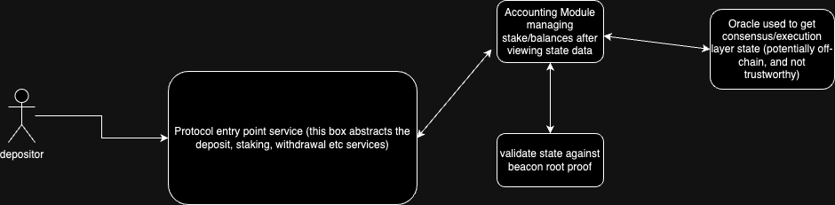

## Objective: Design an integration plan for using the beacon roots contract within a liquid staking protocol.

```
Requirements:

Explain how the beacon roots contract can enhance the security and functionality of a liquid staking derivative (LSD) protocol.
Provide a high-level architecture diagram illustrating the integration of the beacon roots contract with the LSD protocol.
Discuss potential challenges and solutions for integrating the beacon roots contract with the LSD protocol.
```

### Overview
[EIP-4788](https://eips.ethereum.org/EIPS/eip-4788) allows for accessing the beacon chain roots within the EVM execution environment; This allows for applications to access consensus state, which includes validators, their respective balances, and any slashing/penalties incurred.

An LSD protocol can benefit from [consensus state](https://github.com/ethereum/consensus-specs/blob/dev/specs/phase0/beacon-chain.md#beaconstate) information held in the beacon root to help prove things like:
 - periodicially balancing/even-ing stake distribution across a set of validators
 - keeping track of validator slashing and updating the LST supply or taking a similar action
 - LST issuance/management (mentioned in the point above as well)

All of this can be done in a **secure and trust-minimized** fashion by leveraging the beacon roots.

### Integration

Imagine a LST that currently use off-chain services/oracles to access information about consensus state.

Lido uses a similar oracle setup in their [accounting module](https://github.com/lidofinance/lido-oracle?tab=readme-ov-file#accounting-module).

Assuming our LSD protocol uses a similar setup, integration with the beacon roots involves validating the the state recieved from the Oracle Infrastructure against the beacon root state (stored at some contract, and updated every execution block), before executing any actions w.r.t stake distributions/LST issuance.



This would strengthen trust assumptions of critical (validator/slashing etc) state attributes, and add another layer of security to the protocol.

### Challenges

- Beacon root data is updated in every "next" execution block header, which leads to a delay in protocol actions based off consensus state.

- The EVM execution layer doesn't natively understand the beacon root data structures/encoding, so an off-chain service would probablhy have to be used to parse the beacon state data in order to verify against it.

- Proof verification is expensive onchain, and our LSD protocol needs frequent updates. We would need to figure a way to batch proof verification and tune the periodicity.

